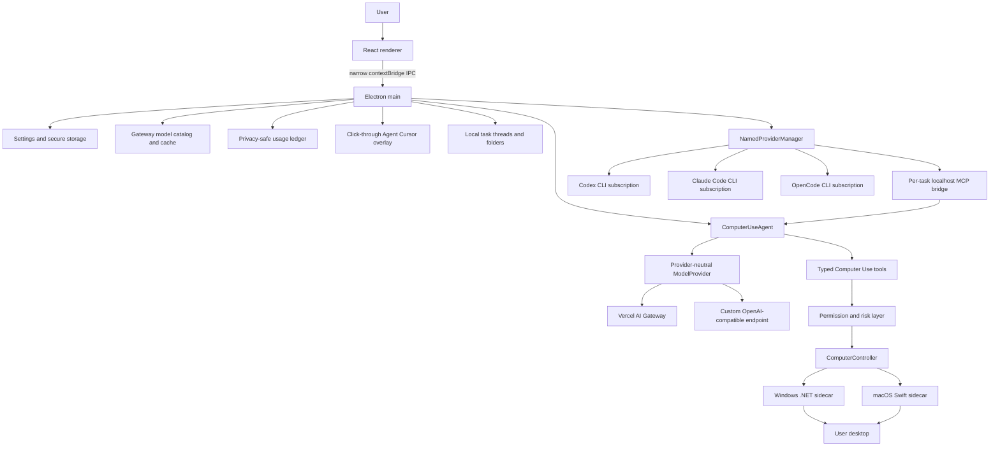

# OpenUse architecture

OpenUse is one desktop product. Electron main owns secrets, the agent runtime, permissions, native-process lifecycle, the usage ledger, and the virtual cursor overlay. React is a typed UI client; it never receives provider secrets, runs the agent loop, or calls native APIs directly.

## Package boundaries

- `packages/shared`: settings, model metadata, cost, cursor, and timeline contracts.
- `packages/protocol`: Zod-validated JSON-lines method/result maps for native controllers.
- `packages/computer`: platform-neutral controller interface and protocol adapter.
- `packages/permissions`: app-level access, session approvals, risk classification, and high-risk approval hooks.
- `packages/ai`: Gateway catalog parsing/cache integration, Gateway provider, custom OpenAI-compatible provider, pricing, reasoning compatibility, and cost metadata validation. It knows nothing about Windows or macOS.
- `packages/agent`: bounded manual loop, tool schemas, observation/action ordering, cancellation, concise events, and cursor telemetry emission.
- `apps/desktop`: composition root, IPC, settings migration, secure storage, usage persistence, overlay lifecycle, shared renderer, named subscription lifecycle, and the guarded MCP bridge.
- `native/windows`: UI Automation, Win32 input/capture, per-monitor DPI, and Windows target geometry.
- `native/macos`: AXUIElement/AppKit/CoreGraphics actions, capture, permissions, and global display-point geometry.

## Runtime ownership

The agent performs one provider request at a time, executes returned tools serially, observes again, and continues until `computer_finish`, cancellation, an error, or the bounded action limit. After every model request the main runtime records token usage and, when supplied and validated by Gateway metadata, the actual request cost. A deduplication key prevents a repeated runtime event from double-counting a request.

The native sidecar is a child process using private JSON-lines stdin/stdout. It does not open a listener or expose a general shell. Stop aborts the provider request, rejects pending protocol work, sends the internal cancellation message, hides the cursor, and leaves the sidecar reusable after its bounded action drains.

## Named subscription providers

Codex, Claude Code, and OpenCode are local authenticated runtimes, not alternate API-key implementations. The main process checks the installed executable and its provider-owned auth status command. It never reads, imports, or displays provider session credentials. A task starts an ephemeral provider process and gives it a random bearer-protected `127.0.0.1` MCP endpoint.

The MCP bridge exposes only the existing typed `computer_*` tools. Calls still pass through OpenUse's Zod validation, application permissions, high-risk approval rules, cancellation, native controller, and cursor telemetry. The provider can observe and act only through that bridge; it receives no shell, PowerShell, unrestricted filesystem, credential, or hidden remote-control tool.

This follows the useful T3 Code boundary: orchestration and lifecycle stay in the host, while each provider adapter owns its authenticated runtime. OpenUse keeps the computer-use policy in one shared agent/controller path so provider choice does not create three different desktop products. Provider sessions are not persisted by OpenUse. Thread continuation is passed as a bounded summary and the current desktop is always re-observed.

Health checks are read-only. A missing CLI is reported as `not-installed`, an installed but logged-out CLI as `not-authenticated`, and an unavailable auth command as `error`. A model ID is optional because the provider's own default is valid; OpenCode and custom/local runtimes report cost as unknown unless trustworthy metadata is supplied.

## Task threads and compaction

Every started task is recorded in the selected local thread. Threads retain the
user-visible command and safe task metrics so work can be continued later;
folders organize threads without changing the agent or provider boundary.
The thread store is separate from the usage ledger and never stores screenshots,
accessibility trees, credentials, private UI text, or chain-of-thought.

When a thread becomes long, the runtime keeps the complete local task history
but supplies the agent only a bounded continuation summary plus the most recent
tasks. The in-memory model transcript is compacted at the same boundary: old
tool observations are replaced with a re-observe instruction while the original
task and a valid recent assistant/tool turn are retained. Continuing a thread
therefore does not replay stale UI state.

## Packaged resource resolution

Development resolves the current platform controller from the repository's published/build output. Installed Windows builds resolve `resources/native/windows/OpenUse.WindowsController.exe`; installed macOS builds resolve the bundled `Contents/MacOS/OpenUseMacController`. No production path depends on a developer checkout.

## Shared platform contract

Native action results may include `targetPoint`, `targetBounds`, `display`, and `coordinateSystem`. The agent forwards those values to the main process as redacted cursor telemetry. Windows reports physical virtual-screen coordinates with per-monitor scale diagnostics. macOS reports global desktop points while captures retain physical pixel dimensions and an explicit mapping. The renderer never receives a raw accessibility tree or private UI content solely for drawing the cursor.

## Appearance layer

macOS uses a transparent BrowserWindow with `under-window` vibrancy. Windows uses a non-layered BrowserWindow with Electron's native Acrylic material and `roundedCorners: true`, which lets DWM keep the backdrop and visible window boundary in one compositor-owned geometry. Older Windows versions fall back to a neutral dark material. The renderer applies the user-selected opacity to its material layer only, so text and controls remain crisp.
