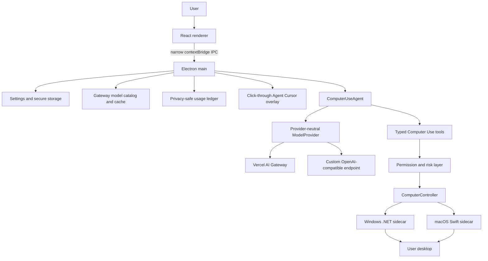

# OpenUse architecture

OpenUse is one desktop product. Electron main owns secrets, the agent runtime, permissions, native-process lifecycle, the usage ledger, and the virtual cursor overlay. React is a typed UI client; it never receives provider secrets, runs the agent loop, or calls native APIs directly.

## Package boundaries

- `packages/shared`: settings, model metadata, cost, cursor, and timeline contracts.
- `packages/protocol`: Zod-validated JSON-lines method/result maps for native controllers.
- `packages/computer`: platform-neutral controller interface and protocol adapter.
- `packages/permissions`: app-level access, session approvals, risk classification, and high-risk approval hooks.
- `packages/ai`: Gateway catalog parsing/cache integration, Gateway provider, custom OpenAI-compatible provider, pricing, reasoning compatibility, and cost metadata validation. It knows nothing about Windows or macOS.
- `packages/agent`: bounded manual loop, tool schemas, observation/action ordering, cancellation, concise events, and cursor telemetry emission.
- `apps/desktop`: composition root, IPC, settings migration, secure storage, usage persistence, overlay lifecycle, and shared renderer.
- `native/windows`: UI Automation, Win32 input/capture, per-monitor DPI, and Windows target geometry.
- `native/macos`: AXUIElement/AppKit/CoreGraphics actions, capture, permissions, and global display-point geometry.

## Runtime ownership

The agent performs one provider request at a time, executes returned tools serially, observes again, and continues until `computer_finish`, cancellation, an error, or the bounded action limit. After every model request the main runtime records token usage and, when supplied and validated by Gateway metadata, the actual request cost. A deduplication key prevents a repeated runtime event from double-counting a request.

The native sidecar is a child process using private JSON-lines stdin/stdout. It does not open a listener or expose a general shell. Stop aborts the provider request, rejects pending protocol work, sends the internal cancellation message, hides the cursor, and leaves the sidecar reusable after its bounded action drains.

## Packaged resource resolution

Development resolves the current platform controller from the repository's published/build output. Installed Windows builds resolve `resources/native/windows/OpenUse.WindowsController.exe`; installed macOS builds resolve the bundled `Contents/MacOS/OpenUseMacController`. No production path depends on a developer checkout.

## Shared platform contract

Native action results may include `targetPoint`, `targetBounds`, `display`, and `coordinateSystem`. The agent forwards those values to the main process as redacted cursor telemetry. Windows reports physical virtual-screen coordinates with per-monitor scale diagnostics. macOS reports global desktop points while captures retain physical pixel dimensions and an explicit mapping. The renderer never receives a raw accessibility tree or private UI content solely for drawing the cursor.

## Appearance layer

macOS uses a transparent BrowserWindow with `under-window` vibrancy. Windows uses a non-layered BrowserWindow with Electron's native Acrylic material and a native rounded shape, which keeps the DWM backdrop inside the same boundary as the rendered surface. Older Windows versions fall back to a neutral dark material. The renderer applies the user-selected opacity to its material layer only, so text and controls remain crisp.
