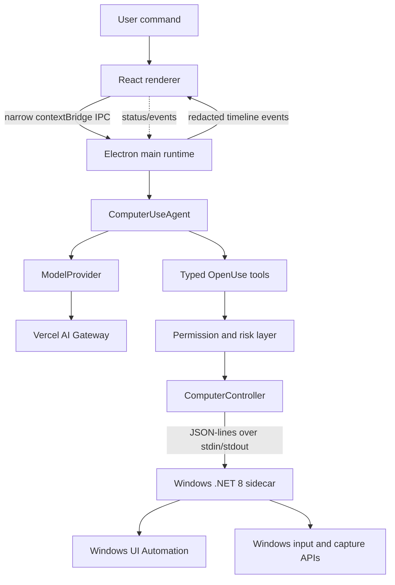

# OpenUse architecture

OpenUse is local-first. The renderer is a view and command surface; it does not receive the Gateway key, hold the agent loop, or call Windows APIs.

## Process ownership

Electron main starts the sidecar only when a task needs it. The sidecar is a child process with private stdin/stdout, no listening socket, and no general shell interface. Each request has an ID and receives exactly one structured response. If the task is stopped, the main process aborts the model request, rejects pending protocol requests, and terminates the sidecar so no queued native action can continue.

## Package boundaries

- `packages/shared` contains domain types, error codes, redaction helpers, and timeline contracts.
- `packages/protocol` contains the JSON-lines method/result map and Zod validation for native messages.
- `packages/computer` owns the platform-neutral controller interface, the protocol-backed controller adapter, and deterministic test doubles.
- `packages/permissions` owns app-level access, session approvals, risk classification, and high-risk approval hooks.
- `packages/ai` owns `ModelProvider` and the Gateway implementation. It knows nothing about Windows or the UI.
- `packages/agent` owns tool schemas, observation/action ordering, step limits, cancellation, and concise event summaries.
- `apps/desktop` composes all services, owns Electron lifecycle and secrets, and exposes a narrow renderer API.
- `native/windows` implements only Windows observation, UI Automation interaction, keyboard/mouse fallback, and screen capture.

## Why the native controller is isolated

Windows UI Automation is a native, stateful API with COM/UI-thread and desktop-session concerns. Keeping it in a sidecar avoids putting OS-specific bindings and failure modes into the renderer, lets the TypeScript agent use a stable contract, and leaves room for `MacComputerController` and `LinuxComputerController` later without changing the agent.
